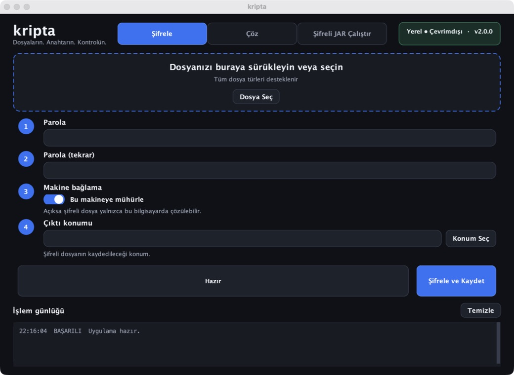

# kripta

Dosyaları ve Java uygulamalarını **AES-256-GCM + Argon2id** ile şifreleyen,
isteğe bağlı olarak kullanılan bilgisayara mühürleyen açık kaynaklı masaüstü ve
komut satırı uygulaması.



## Neler sunuyor?

- **Modern masaüstü arayüzü:** Şifreleme, çözme ve şifreli JAR çalıştırma tek
  pencerede.
- **Güçlü şifreleme:** Dosya içeriği AES-256-GCM ile gizlenir ve bütünlüğü
  doğrulanır.
- **Parola güçlendirme:** Argon2id, parola tahmin saldırılarını pahalılaştırmak
  için 64 MiB bellek kullanır.
- **Makineye mühürleme:** Dosya, bilgisayarın parmak izi anahtar türetimine
  katılarak yalnızca aynı makinede açılabilir.
- **Taşınabilir mod:** Makine mühürleme kapatılarak dosya doğru parolaya sahip
  başka bilgisayarlarda da açılabilir.
- **Bellekte JAR çalıştırma:** Şifreli Java uygulaması açık JAR dosyası diske
  yazılmadan çalıştırılır.
- **Kurcalama tespiti:** Yanlış parola, değiştirilmiş başlık veya bozulmuş veri
  güvenli biçimde reddedilir.
- **Çapraz platform:** macOS, Windows ve Linux paketleri GitHub Actions ile
  üretilebilir.

## Hızlı başlangıç

### Masaüstü uygulaması

En kolay yol, projenin [Releases](https://github.com/se7enbyte/kripta/releases)
sayfasından işletim sistemine uygun paketi indirmektir.

#### Windows

`kripta-2.0.1.msi` dosyasını çalıştırıp kurulumu tamamla. Uygulama kurulum
bitince otomatik açılmaz; **Başlat Menüsü → kripta** veya masaüstündeki
**kripta** kısayolundan başlatılır. Kurulum kullanıcı hesabına yapılır ve Java'yı
ayrıca yüklemek gerekmez.

Uygulama açılmazsa hata kaydı şu konuma yazılır:

```text
%USERPROFILE%\.kripta\kripta.log
```

Kaynak koddan çalıştırmak için JDK 21 veya üzeri gerekir:

```bash
git clone https://github.com/se7enbyte/kripta.git
cd kripta
./setup.sh
./kripta-gui
```

Arayüzde dosyayı pencereye sürükleyebilir veya **Dosya Seç** düğmesini
kullanabilirsin. Ardından parola, makine bağlama tercihi ve çıktı konumunu
belirleyip işlemi başlatman yeterlidir.

### Terminal kullanımı

Projeyi derleyip test etmek:

```bash
./build.sh
```

Dosyayı mevcut bilgisayara mühürleyerek şifrelemek:

```bash
./kripta encrypt uygulama.jar uygulama.enc
```

Her bilgisayarda doğru parolayla açılabilen taşınabilir dosya üretmek:

```bash
./kripta encrypt uygulama.jar uygulama.enc --no-bind
```

Şifreyi çözmek:

```bash
./kripta decrypt uygulama.enc uygulama.jar
```

Şifreli JAR'ı açık hâlini diske yazmadan çalıştırmak:

```bash
./kripta run uygulama.enc com.ornek.Main arg1 arg2
```

CI veya script ortamında parola `KRIPTA_KEY` değişkeninden sağlanabilir:

```bash
KRIPTA_KEY='guclu-bir-parola' ./kripta encrypt dosya.bin dosya.enc --no-bind
```

Parolayı doğrudan komut satırı argümanı olarak verme; işlem listesinde ve shell
geçmişinde görünebilir.

## Güvenlik mimarisi

Şifreleme sırasında her dosya için rastgele 16 bayt salt ve 12 bayt nonce
üretilir. Parola, Argon2id ile 256 bit anahtara dönüştürülür; dosya ve konteyner
başlığı AES-256-GCM tarafından doğrulanır.

```text
Parola + Salt + isteğe bağlı makine parmak izi
                        │
                        ▼
        Argon2id (64 MiB, 3 tur, 4 paralellik)
                        │
                        ▼
                  256 bit anahtar
                        │
                        ▼
                  AES-256-GCM
```

Şifreli konteyner `KRPT` imzası, format sürümü, KDF bilgisi, makine bağlama
bayrağı, salt, nonce ve doğrulanmış şifreli veriden oluşur. Başlıktaki tek bir
baytın değiştirilmesi bile çözme işlemini başarısız kılar.

## Çıkış kodları

| Kod | Anlamı |
|---:|---|
| `0` | İşlem başarılı |
| `1` | Kullanım, dosya veya genel çalışma hatası |
| `2` | Yanlış parola, yanlış makine veya kurcalanmış dosya |
| `3` | Debugger veya Java agent tespit edildi |

## Yerel paket oluşturma

JDK içindeki `jpackage` kullanılarak çalışılan platforma ait kurulum paketi
oluşturulur:

```bash
./package.sh
```

Paket `dist/` klasörüne yazılır. macOS'ta DMG, Linux'ta DEB üretilir. Windows
MSI paketi GitHub Actions'ın Windows runner'ında oluşturulur.

## GitHub Release oluşturma

`v` ile başlayan bir Git etiketi gönderildiğinde release iş akışı üç platformun
paketlerini üretip GitHub Releases'a ekler:

```bash
git tag v2.0.1
git push origin v2.0.1
```

## Proje yapısı

| Dosya | Görevi |
|---|---|
| `Gui.java` | Koyu temalı Swing masaüstü arayüzü |
| `Crypto.java` | AES-256-GCM ve Argon2id şifreleme çekirdeği |
| `MachineKey.java` | Makine parmak izi üretimi |
| `Loader.java` | Şifreli JAR'ın bellekten çalıştırılması |
| `Passphrase.java` | Gizli parola girişi ve ortam değişkeni desteği |
| `Guard.java` | Temel debugger/agent tespiti |
| `Kripta.java` | Komut satırı yönlendiricisi |
| `SelfTest.java` | Uçtan uca güvenlik ve round-trip testleri |

## Dürüst güvenlik notu

kripta güçlü dosya şifreleme sağlar ve sıradan kopyalama/analiz girişimlerinin
maliyetini artırır; ancak çalışan istemci kodunu mutlak biçimde gizleyemez.
Uygulama çalışırken gerekli sınıflar bellekte çözülür. Makineyi tamamen kontrol
eden deneyimli bir tersine mühendis bellek dökümü alabilir, makine parmak izini
taklit edebilir veya anti-debug kontrolünü kaldırabilir.

Lisanslama, ödeme veya kritik iş mantığı gibi gerçekten gizli kalması gereken
işlemleri istemciye göndermek yerine sunucuda tutmak en güvenli yaklaşımdır.

## Lisans

[MIT](LICENSE)
